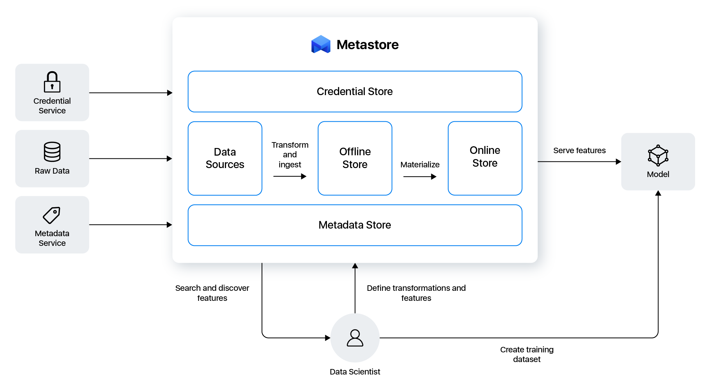

# Overview

Metastore Python SDK.

Feature store and data catalog for machine learning.

<p align="center">
    
</p>

## Prerequisites

* [Python (>=3.8.0)](https://www.python.org)

## Installation

Install package:

```console
pip install metastore[all]
```

## Usage

### Create project definition

```yaml
# metastore.yaml

name: 'customer_transactions'
display_name: 'Customer transactions'
description: 'Customer transactions feature store.'
author: 'Metastore Developers'
tags:
  - 'customer'
  - 'transaction'
version: '1.0.0'
credential_store:
    type: 'file'
    path: '/path/to/.env'
metadata_store:
    type: 'file'
    path: 's3://path/to/metadata.db'
    s3_endpoint:
        type: 'secret'
        name: 'S3_ENDPOINT'
    s3_access_key:
        type: 'secret'
        name: 'S3_ACCESS_KEY'
    s3_secret_key:
        type: 'secret'
        name: 'S3_SECRET_KEY'
offline_store:
    type: 'file'
    path: 's3://path/to/features/'
    s3_endpoint:
        type: 'secret'
        name: 'S3_ENDPOINT'
    s3_access_key:
        type: 'secret'
        name: 'S3_ACCESS_KEY'
    s3_secret_key:
        type: 'secret'
        name: 'S3_SECRET_KEY'
online_store:
    type: 'redis'
    hostname:
        type: 'secret'
        name: 'REDIS_HOSTNAME'
    port:
        type: 'secret'
        name: 'REDIS_PORT'
    database:
        type: 'secret'
        name: 'REDIS_DATABASE'
    password:
        type: 'secret'
        name: 'REDIS_PASSWORD'
data_sources:
  - name: 'postgresql_data_source'
    type: 'postgresql'
    hostname:
        type: 'secret'
        name: 'POSTGRESQL_HOSTNAME'
    port:
        type: 'secret'
        name: 'POSTGRESQL_PORT'
    database:
        type: 'secret'
        name: 'POSTGRESQL_DATABASE'
    username:
        type: 'secret'
        name: 'POSTGRESQL_USERNAME'
    password:
        type: 'secret'
        name: 'POSTGRESQL_PASSWORD'
```

### Create feature definitions

```python
# feature_definitions.py

from datetime import timedelta

from metastore import (
    FeatureStore,
    FeatureGroup,
    Feature,
    ValueType
)


feature_store = FeatureStore(repository='/path/to/repository/')

feature_group = FeatureGroup(
    name='customer_transactions',
    record_identifiers=['customer_id'],
    event_time_feature='timestamp',
    features=[
        Feature(name='customer_id', value_type=ValueType.INTEGER),
        Feature(name='timestamp', value_type=ValueType.STRING),
        Feature(name='daily_transactions', value_type=ValueType.FLOAT),
        Feature(name='total_transactions', value_type=ValueType.FLOAT)
    ],
    enable_online_store=True,
    expires_in=timedelta(days=1),
    tags={
        'category': 'services',
        'year': '2022'
    }
)

feature_store.apply(feature_group)
```

### Ingest features

```python
# ingest_features.py

from metastore import FeatureStore


feature_store = FeatureStore(repository='/path/to/repository/')

dataframe = feature_store.read_from_source(
    'postgresql_data_source',
    table='customer_transaction',
    index_column='customer_id',
    partitions=10
)

feature_store.ingest('customer_transactions', dataframe)
```

### Materialize features

```python
# materialize_features.py

from datetime import datetime

from metastore import FeatureStore


feature_store = FeatureStore(repository='/path/to/repository/')

feature_store.materialize(
    'customer_transactions',
    end_date=datetime.utcnow()
)
```

### Retrieve historical features

```python
# retrieve_historical_features.py

from datetime import datetime

import modin.pandas as pd
from metastore import FeatureStore


feature_store = FeatureStore(repository='/path/to/repository/')

record_identifiers = pd.DataFrame({
    'customer_id': [00001],
    'timestamp': [datetime.utcnow()]
})

dataframe = feature_store.get_historical_features(
    record_identifiers=record_identifiers,
    features=[
        'customer_transactions:daily_transactions',
        'customer_transactions:total_transactions'
    ]
)

print(dataframe.head())
```

### Retrieve online features

```python
# retrieve_online_features.py

import modin.pandas as pd
from metastore import FeatureStore


feature_store = FeatureStore(repository='/path/to/repository/')

record_identifiers = pd.DataFrame({
    'customer_id': [00001]
})

dataframe = feature_store.get_online_features(
    record_identifiers=record_identifiers,
    features=[
        'customer_transactions:daily_transactions',
        'customer_transactions:total_transactions'
    ]
)

print(dataframe.head())
```
